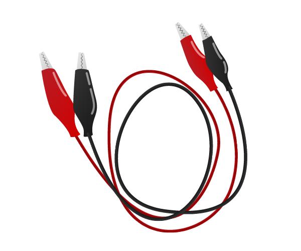
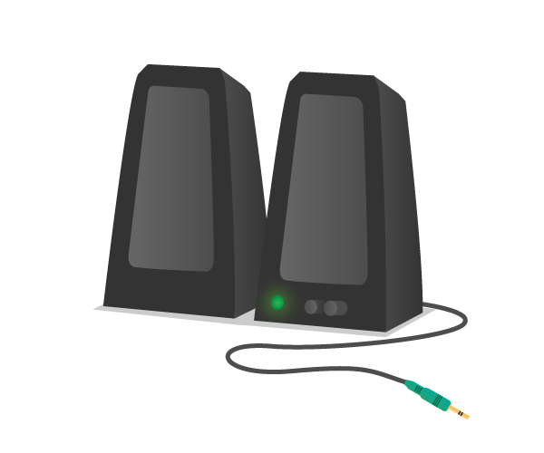

## What you will need

### Hardware

|2x Crocodile clip cables | 2x pin-to-socket jumper leads | 1x Speakers |
|:--------:|:-------:|:--------:|
|     |  |  |

### Software

There are no additional software requirements for this resource beyond what is pre-installed in the current Raspbian image. To make sure your SD card is up-to-date, see the [updating Raspbian guide](https://www.raspberrypi.org/documentation/raspbian/updating.md).

### Extras

You'll also need:

- Paper plates
- Cardboard
- Aluminium foil
- Glue
- Scissors
- Sponge 
- Bulldog or paper clips
- Sticky tape
- Copper tape
