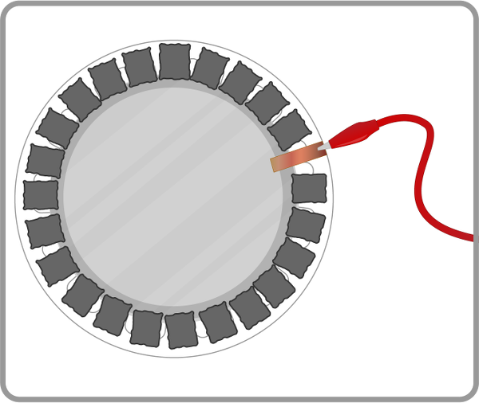

## Step 1: Making the Whoopi cushion

1. Cut a circle from the cardboard to fit the centre of the “eating” side of each paper plate. 
1. Tape or stick squares of foil onto the cardboard. These are your contacts: when they touch, they will complete a circuit.
1. Using some copper tape, connect the foil to the edge of the plate.
1. Chop the sponge up into cuboid chunks and glue them around the foil on one of the plates: this will stop the foil squares touching each other until someone sits on the plate. It should look something like this:

	

1. Put the two plates together so that the foil pieces are on the inside and facing each other. Offset the paper plates so that the copper tape sections are not touching. 
1. You now have a “cushion” made of two plates. You can tape the plates together, or you might choose to use bulldog or paper clips so that you can test that your cushion works correctly and easily debug any hardware problems.