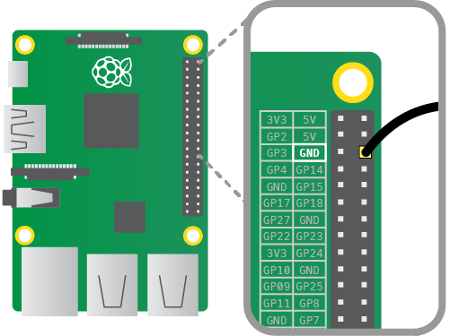
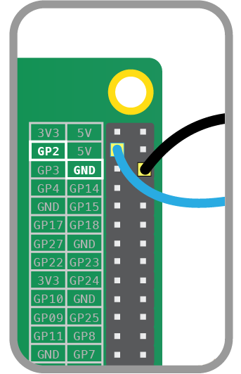
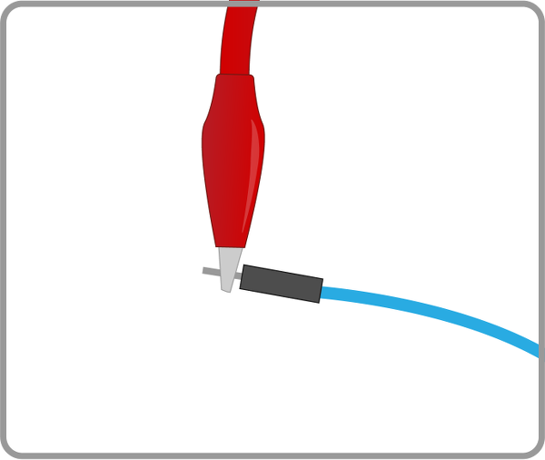
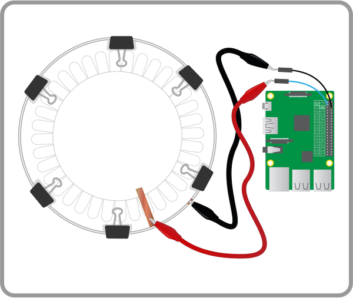

## Connect the whoopee cushion to the Pi

1. Plug one header lead (it doesn’t matter which) onto a ground (GND) pin on the Pi:

	

	**Note**: if you have an older Raspberry Pi model you'll only have 26 pins but they have the same layout.

1. Plug the other wire onto GPIO pin 2:

	

1. Clip a crocodile clip cable to one of the paper plates' copper tape sections.

1. Then connect the other end of the crocodile clip cable to the pin of one of the connected jumper wires. 

	

1. Repeat these last two steps to connect the other plate to your Raspberry Pi.

	Your setup should look something like this:

	
	
